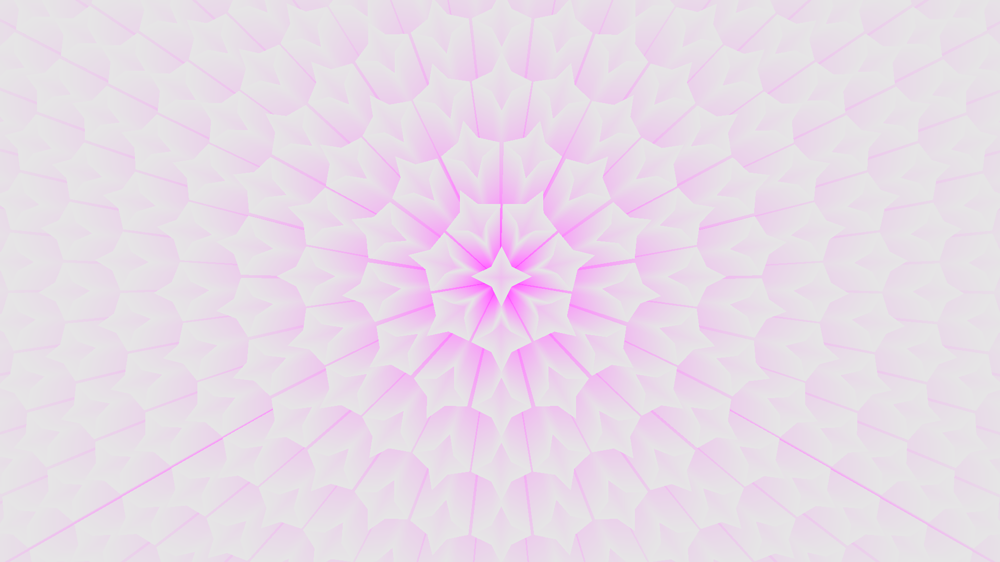

# the_globe

This demo showcases my orbit camera approach based on [Ken Shoemake's ArcBall](https://citeseer.ist.psu.edu/viewdoc/summary?doi=10.1.1.457.6530).
It is controled via mouse input and translates the rotation immediately while holding down the LMB.
At the same time, the momentum is captured and on abruptly releasing the LMB it is translated into an animation, which smoothly exhausts over time.

The rendered globe is not generated as a mesh, but as a sample pattern aligned with the coordinate grid of latitude and longitude.
The single control parameter is the number of samples at the equator, which during generation is decreased per ring towards the poles for a more unified sample distribution.
In the same fashion, the size of the sample marker is computed depending on the sample density.
Thus, the globe can easily be computed for different levels of quality of which three can be choosen in the demo.

As the third and last key feature, global elevation data is mapped onto the sample pattern and the sample geometry is offset accordingly.
The source of the data are [32 JPEG squares](https://www.ngdc.noaa.gov/mgg/image/2minrelief.html), each covering 45x45 degree portion of the globe, which are parsed into a single data matrix.
In the source, the elevation is encoded into RGB pixel and thus needs to be decoded into a single value.
Finally mapping the data onto the sample pattern is done by averaging over the surrounding region depending on the sample marker size and thus on the sample density.

Dependencies:
- CMake
- OpenGL + GLEW + GLM
- [GLFW3](https://www.glfw.org/)

Build:
- ./run cmake
- ./run make
- ./run

In part based on Hector Peeters's [opengl_premake_boilerplate](https://github.com/HectorPeeters/opengl_premake_boilerplate).
